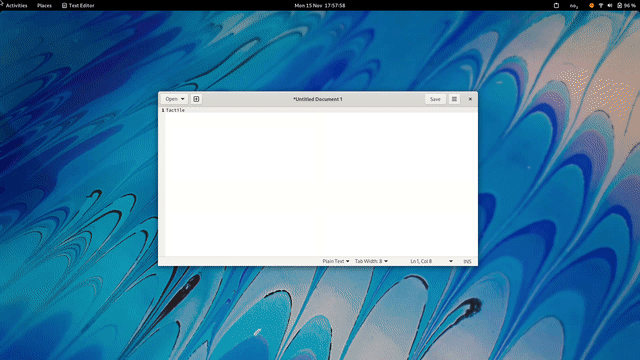
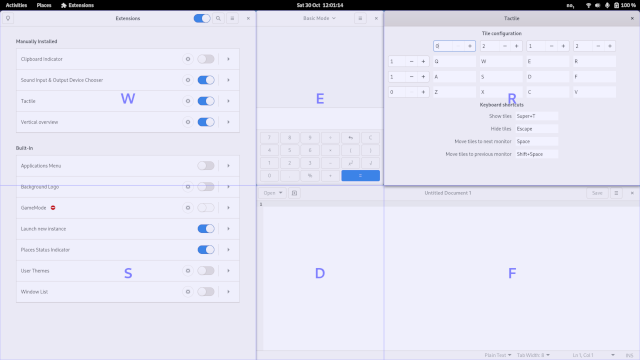

# ctile

Forked from [lundal/tactile](https://gitlab.com/lundal/tactile) but adapts the tiling to act as [pogobanane/xfce-ctile](https://gitlab.com/pogobanane/xfce-ctile).

# Tactile

A window tiling extension for GNOME Shell.

> Tile windows on a custom grid using your keyboard. Type Super-T to show the grid,
> then type two tiles (or the same tile twice) to move the active window.
>
> The grid can be up to 4x3 (corresponding to one hand on the keyboard)
> and each row/column can be weighted to take up more or less space.

https://extensions.gnome.org/extension/4548/tactile/

## Examples

## License

Tactile is distributed under the terms of the GNU General Public License v3.0 or later.
See the [license](LICENSE) file for details.
